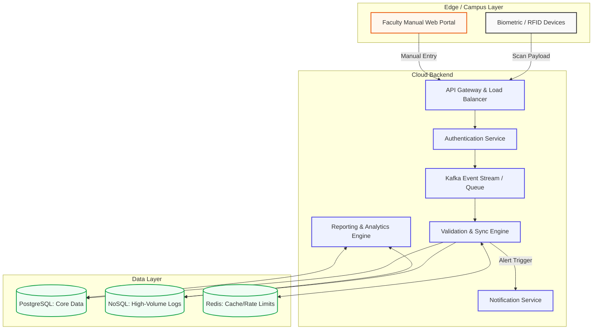

# AttendSmart: Case Study Assignment Answers

## Q1. Requirements Analysis
**Functional Requirements:**
*   **Attendance Capture:** System must capture attendance via Biometrics, RFID, QR Codes, and Manual Faculty Web Portals.
*   **Real-time Dashboard:** Administrators and teachers must have a live view of attendance statistics and classroom rosters.
*   **Reporting Engine:** Ability to generate and export attendance reports (e.g., CSV/PDF formats).
*   **Notification System:** Automatic alerts dispatched to parents and students regarding absences, late arrivals, or low attendance rates.
*   **Authentication:** Secure login for faculty and administrators with role-based access control.

**Non-Functional Requirements:**
*   **Scalability:** Must handle concurrent attendance updates from millions of students simultaneously.
*   **High Availability & Fault Tolerance:** The system must remain operational even during localized network failures or database outages.
*   **Data Security:** Student records and biometric templates must be encrypted and securely stored.

**Why Reliability, Synchronization, and Scalability are Important:**
With millions of students across distributed campuses, a lack of **scalability** would cause server crashes during peak morning check-in windows. **Synchronization accuracy** is critical so that an absence recorded at a remote campus is instantly visible to central administration without data conflicts. **Reliability** ensures that no attendance record is lost, preventing false truancy alerts and maintaining academic integrity.

---

## Q2. System Architecture Design
The architecture utilizes a distributed cloud model to decouple ingestion from processing:



---

## Q3. Attendance Collection and Reporting Workflow
1.  **Collection:** A student taps an RFID badge or a faculty member submits a manual status via the Web App. The edge device sends a JSON payload containing the `studentId`, `deviceId`, and `timestamp` to the API Gateway.
2.  **Validation:** The Validation Engine pulls the event from the Kafka stream. It checks Redis to ensure this isn't a duplicate scan (e.g., student swiping twice in 10 seconds). It then verifies if the timestamp falls within the scheduled class time window.
3.  **Synchronization:** Once validated, the event is permanently written to the NoSQL database. Distributed campuses are kept in sync because all edge devices publish to the centralized cloud queue, which processes events linearly.
4.  **Reporting & Analytics:** The Reporting Engine queries the SQL database to update aggregate counts (e.g., total presents/absents). If a student's attendance drops below a mandatory threshold, the engine triggers the Notification Service to dispatch an SMS/Email to the parents.

---

## Q4. Database Design
A polyglot persistence strategy is required to handle the scale efficiently:

**1. Relational Database (SQL - PostgreSQL)**
Used for structured, highly relational data that requires ACID compliance.
*   **`students` table:** `student_id` (PK), `name`, `email`, `parent_email`, `total_present`, `total_absent`.
*   **`schedules` table:** `schedule_id` (PK), `class_name`, `start_time`, `end_time`.

**2. NoSQL Database (Cassandra / MongoDB)**
Used for high-velocity, append-only time-series data.
*   **`scan_logs` collection:** Stores millions of raw hardware scans daily. `log_id`, `student_id`, `device_id`, `timestamp`, `verification_method`, `status`.

**3. In-Memory Cache (Redis)**
*   Used to store temporary session tokens and implement "debouncing" (locking a `student_id` for 60 seconds after a scan to prevent duplicate entries).

---

## Q5. Algorithm and Implementation
Below is a simplified Python-based approach for the Validation Engine. It ensures students are checking in during class hours and prevents immediate duplicate scans using a cache.

```python
import time

duplicate_cache = {}

def validate_and_log_attendance(payload, schedule, db_cursor):
    student_id = payload.get("studentId")
    status = payload.get("status") # "Present", "Late", "Absent"
    method = payload.get("method")
    scan_minutes = payload.get("scan_minutes_from_midnight")

    # 1. Duplicate Prevention Check
    dup_key = f"{student_id}_{schedule['id']}"
    if dup_key in duplicate_cache:
        return {"success": False, "reason": "DUPLICATE_SCAN_DETECTED"}

    # 2. Temporal Validation
    start_minutes = schedule["start_time_minutes"]
    end_minutes = schedule["end_time_minutes"]

    if scan_minutes < (start_minutes - 15) or scan_minutes > end_minutes:
        return {"success": False, "reason": "OUTSIDE_SCHEDULE_WINDOW"}

    # 3. Add to Cache to prevent immediate double-scans
    duplicate_cache[dup_key] = time.time()

    # 4. Database Updates
    if status == "Present":
        db_cursor.execute("UPDATE students SET presents = presents + 1 WHERE id = ?", (student_id,))
    elif status == "Absent":
        db_cursor.execute("UPDATE students SET absents = absents + 1 WHERE id = ?", (student_id,))
    
    db_cursor.execute("INSERT INTO logs (student_id, method, status) VALUES (?, ?, ?)", 
                      (student_id, method, status))
    
    return {"success": True, "message": f"Successfully marked {status}"}
```

---

## Q6. Scalability and Fault Tolerance
**Scalability:**
*   **Message Queuing (Kafka):** By placing Apache Kafka between the API Gateway and the Validation Engine, the system can absorb massive spikes in traffic (e.g., millions of students checking in exactly at 8:00 AM) without crashing the database. The validation workers process the queue at a sustainable rate.
*   **Database Sharding:** The NoSQL database storing the logs can be sharded horizontally based on `campus_id` or `region` to distribute read/write loads.

**Fault Tolerance:**
*   **Device Offline Mode:** Edge devices and web apps are built with local caching logic. If the campus loses internet, devices continue to collect scans locally. Once the connection is restored, they batch-sync the queued payloads to the cloud (This offline sync logic is implemented in our `app.js` frontend script).
*   **Redundancy:** API Gateways are deployed behind Load Balancers across multiple availability zones. If one server goes down, traffic is automatically routed to healthy instances.
