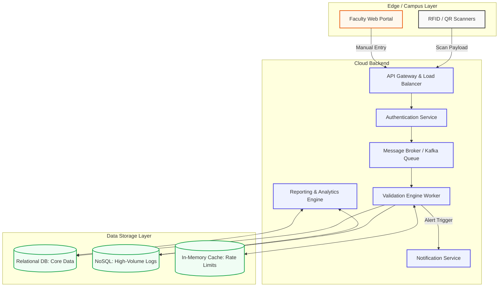

# 🎓 AttendSmart: Enterprise Cloud Attendance System

**Deployment Link:** [https://attendsmart.onrender.com/home.html](https://attendsmart.onrender.com/home.html)  
**Submitted By:** NUPUR BHOIR / 150096724180  
**Course/Degree:** BTECH-CSE  

<div align="center">
  
  
  
  
  
</div>

---

## 🚀 Project Vision
**AttendSmart** is a highly scalable, enterprise-grade academic attendance management platform designed to track student attendance across distributed institutions in real-time. By decoupling the ingestion of attendance records from the backend processing using a simulated **Message Broker (Kafka-style)**, the system is designed to handle immense scale without data loss or race conditions.

---

## 🏗️ System Architecture & Data Flow

To handle massive scale and prevent database bottlenecks during peak check-in hours, the system utilizes a distributed event-driven architecture.



> **Note on Local Implementation:** For ease of deployment, the heavyweight Message Broker and databases are simulated in-memory using Python `Threading/Queues` and `SQLite3`. The production-ready Kafka Producer and Consumer scripts are included in `kafka_producer.py` and `kafka_consumer.py`.

---

## ✨ Core Features & Microservices

*   **⚡ Event-Driven Processing:** Uses publisher/subscriber messaging to prevent race conditions and handle high throughput (e.g., 500,000 students checking in at 8:00 AM).
*   **🛡️ Multi-Modal Ingestion:** Accepts real-time POST payloads from hardware IoT scanners and manual faculty override portals.
*   **⏱️ Temporal Validation:** Automatically rejects check-ins that fall outside of the strictly scheduled classroom time bounds.
*   **🔄 Duplicate Prevention:** Employs caching logic to reject duplicate badge swipes occurring within a 60-second window.
*   **📊 Live Web Dashboard:** A Vanilla JS frontend that pulls analytics directly from the SQL database and renders real-time streaming logs.

---

## 🛠️ Technology Stack

| Component | Technology | Purpose |
| :--- | :--- | :--- |
| **Frontend UI** | HTML5, CSS3, Vanilla JS | Lightweight, lightning-fast administrative dashboards. |
| **API Gateway** | Python 3 (`http.server`) | Core request routing and authentication. |
| **Message Broker**| Confluent Kafka / Python Queues | Asynchronous event streaming and payload buffering. |
| **Database** | SQLite3 / PostgreSQL | Relational persistence for student metrics and analytics. |
| **Deployment** | Docker & Docker Compose | Containerized environments for DevOps CI/CD pipelines. |

---

## 🐳 DevOps & Deployment

This project is fully Dockerized for seamless deployment across any cloud provider (AWS, Azure, GCP).

### Quick Start (Docker)
1. Ensure Docker Desktop is running.
2. Clone the repository and boot the container:
   ```bash
   git clone https://github.com/YourUsername/AttendSmart.git
   cd AttendSmart
   docker-compose up --build
   ```
3. Open `http://localhost:8000/home.html` in your browser.

### Quick Start (Local / Python Native)
1. Start the API Gateway natively:
   ```bash
   python3 server.py
   ```
2. Open `http://localhost:8000/home.html` in your browser.

---

## 📂 Repository Structure

*   `server.py`: The core API Gateway, Backend Database connections, and simulated Message Broker.
*   `kafka_producer.py` / `kafka_consumer.py`: Production-ready Confluent Kafka architecture files.
*   `dashboard.html` / `simulator.html`: The UI endpoints for administrators and faculty.
*   `app.js` / `style.css`: Frontend logic for fetching REST APIs and rendering dynamic content.
*   `attendance.db`: The local SQLite persistence layer storing Users, Analytics, and Event Logs.
*   `Assignment_Answers.md`: Full theoretical breakdowns answering the 6 core system design case study questions.
*   `Dockerfile` & `docker-compose.yml`: DevOps configuration files for containerization.

---
*Designed for advanced academic system design analysis and distributed systems research.*
