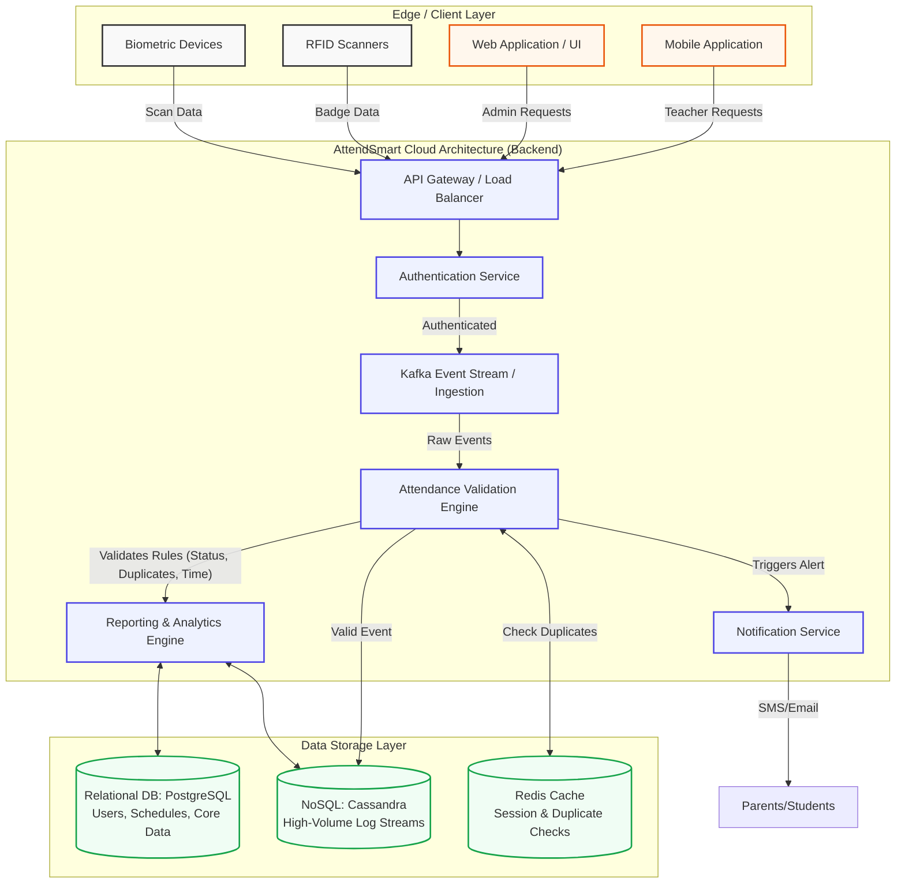

# System Architecture Diagram - AttendSmart

The following architecture diagram illustrates the overall system design, components, modules, and their interactions for the AttendSmart platform.

## Interaction Summary
1. **Edge Devices** (Biometric/RFID) and **Faculty Web Portals** continuously push scan events to the **API Gateway**.
2. The Gateway authenticates the request and queues the event in the **Event Stream** to handle millions of concurrent updates smoothly.
3. The **Validation Engine** pulls events, verifies temporal bounds (class schedule), and checks **Redis** to prevent immediate duplicate scans.
4. Validated data is committed to the **NoSQL Database** (for massive scale).
5. The **Reporting Engine** aggregates data for the Dashboard UI, querying both NoSQL and PostgreSQL.
6. The **Notification Service** dispatches real-time alerts if a student is flagged as absent, late, or falling below compliance thresholds.
